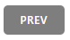
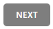

# TiVi - Ticket Viewer

## Zendesk - Intern Coding Challenge 2019

**Author**: Bac Trach Dam

**Github**: https://github.com/bacdam91

## Preface

Even though I never had completed my formal education for IT, nor have I got any real-world and industry experience, without sounding overly self-praiseful, I must admit that what I am presenting to all you good folks at Zendesk is the best product I have made so far. Of course, I hope to further learn, either through your institution or by my own effort or both, so that I can build better softwares that are useful to others.

The knowledge (NodeJS, JS, Angular, ExpressJS ) and techniques (AJAX, Accessing external APIs) that I would like to demonstrate here with this project is attained over a relatively short amount of time, in the realm of 2-3 months prior or even shorter. Who is keeping track of time right? Especially, when I am having so much fun writing codes. Before this, I had learnt other languages and used other programming tools.

Anyway, without further ado, please have a look at this README and (I assume you'd be doing) break my codes. Regardless of the application result, I would like to thank you for spending your time having a look at my submission and look forward to hearing your feedbacks. I hope to have the opportunity to sitting down with you to explain what I have done here a little more!

## System Requirements

1. NodeJS
2. Internet browser

## Installation Instructions

1. Clone the git repository to your local terminal (https://github.com/bacdam91/zendesk-intern-coding-challenge-2019.git)
2. Open your terminal and navigate to the project's root directory
3. Run command `npm install` to install all dependencies
4. Run the following commands (for OS X) to set the environment variables (username and password) to access the Zendesk account for this project
    - `export ZENDESK_USERNAME=bacdam91@hotmail.com`
    - `export ZENDESK_PASSWORD=HelloWorld123`
5. Start the server with `node index` command
6. Open your internet browser and go to:
    - localhost:3000 (For local machine)

## Usage Instructions

### Basic Usage

#### Overview

-   The application has 3 distinct UI components: the navigation bar, the ticket list and the ticket viewer.
-   The ticket list component (TLC - which is also an acronym for Tender Loving Care) will automatically load 25 tickets from Zendesk. The tickets are sort by newest to oldest by default.
-   Hovering over each individual ticket item will trigger it to enlarge prompting that it is an active and clickable item.
-   All clickable/actionable items have visual cues to indicate that they are so.

![alt text][usage_screenshot_01]

[usage_screenshot_01]: ./screenshots/usage/screenshot_01.png "Ticket list in action"

#### The components

-   The TLC has two separate components within it: the filter and the list of tickets.

#### The navigation

-   Within the filter component there are navigation buttons to facilitate going back and forth between pages.

![alt text][usage_screenshot_02]

[usage_screenshot_02]: ./screenshots/usage/screenshot_02.png "Ticket filter"

-   When the ticket list is displaying the first page, according to the filter settings, the PREV button is grey, indicating that it is no longer clickable .
-   When the ticket list is displaying the last page, according to the filter settings, the NEXT button is grey, indicating that it is no longer clickable .

#### The filter

-   The filter also provides means to sort the tickets. The filter component allows the end-user to retrieve the tickets sorted according the available fields in either ascending or descending order.
-   When navigating between the pages, the filter settings are taken into account and the previous pages or next pages are retrieved accordingly. This means if the filter settings are changed before clicking the "prev" or "next" button the newly retrieved page will have the new settings applied. As a result, the newly retrieved pages may contain tickets from the preceeding pages.
-   Similarly, clicking the "refresh" button, will apply the filter settings and retrieve the current page of the sorted result, which means some or all tickets will change in the ticket list.

#### The ticket list

-   The ticket list is used to browse the tickets.

![alt text][usage_screenshot_03]

[usage_screenshot_03]: ./screenshots/usage/screenshot_03.png "Ticket list"

#### The ticket item

-   The ticket item contains 5 types of information: the priority, the ticket id, the status, the subject and the creation date.
    -   The ticket priority is represented as a bar at the left end of the ticket item. Each different priority state is represented as a different colour.
    -   The ticket id displayed as plain text.
    -   The ticket status is represented as a badge with the first letter of each status in uppercase, each with different colour.
    -   The ticket subject is displayed as plain text.
    -   The ticket creation date is displayed as plain text in the format of "dd/MM/yy hh:mm a".
-   The images below shows different tickets with different priority states and status.

##### Legend for different ticket priorities

-   RED: Urgent
-   YELLOW: High
-   GREEN: Normal
-   BLUE: Low

![alt text][usage_screenshot_06]

[usage_screenshot_06]: ./screenshots/usage/screenshot_06.png "Different priority states"

##### Legend for different ticket statuses

-   N (Green): New
-   O (Red): Open
-   P (Pink): Pending
-   H (Yellow): Hold
-   S (Blue): Solved
-   C (Grey): Closed

![alt text][usage_screenshot_07]

[usage_screenshot_07]: ./screenshots/usage/screenshot_07.png "Different statuses"

-   To view the full details of a ticket, click on that ticket item in the ticket list. This will retrieve all the ticket information from Zendesk and display it in the ticket viewer component.

#### The Ticket View

-   The ticket view component is separated into two components: the ticket toolbar and the ticket view.

#### The Ticket Toolbar

-   The ticket toolbar shows the currently viewing ticket id, status, priority and type in the ticket details panel and the associated tags in the tags panels.

![alt text][usage_screenshot_08]

[usage_screenshot_08]: ./screenshots/usage/screenshot_08.png "Ticket Details Panel"

![alt text][usage_screenshot_09]

[usage_screenshot_09]: ./screenshots/usage/screenshot_09.png "Tags Panel"

#### The Ticket View

-   The ticket view component shows the subject, requester id, creation time in the header and the description and last update time in the body.

![alt text][usage_screenshot_10]

[usage_screenshot_10]: ./screenshots/usage/screenshot_10.png "Ticket View"

## Happy Path Testing Instructions

There are 4 tests written for this application.

-   The first test (Ticket View Test) tests if by clicking on a ticket item the ticket is loaded properly in the ticket view.
-   The second test (Navigation Test) tests the NEXT and PREV buttons and their visual cues.
-   The third test (Filter Test 01) tests the filters via the refresh button.
-   The fourth test (Filter Test 02) tests the filters via the navigation buttons.

_The screenshots below are run in Windows Command Line. However the commands works for OS X also._

1. Open two terminal instances and navigate to the project root folder in each instance.
2. In one terminal start the server with the command `node index`. There should be an output showing the port it is listening to (default to port 3000).

![alt text][testing_screenshot_01]

[testing_screenshot_01]: ./screenshots/testing/screenshot_01.png "Start server"

3. In the other terminal, run the command `npm run cypress:open` to start cypress (a testing tool). This should open a cypress file explorer window.

![alt text][testing_screenshot_02]

[testing_screenshot_02]: ./screenshots/testing/screenshot_02.png "Start cypress"

![alt text][testing_screenshot_03]

[testing_screenshot_03]: ./screenshots/testing/screenshot_03.png "Cypress file explorer"

3. If the above command does not work, use the following `./node_modules/.bin/cypress open`.
   _(Please note the screenshot is using back slashes `\` as it is taken from a Windows computer)_

![alt text][testing_screenshot_05]

[testing_screenshot_05]: ./screenshots/testing/screenshot_05.png "Cypress file explorer"

4. Click on the file `_tivi_happy_path_test.js` to start the test.

![alt text][testing_screenshot_04]

[testing_screenshot_04]: ./screenshots/testing/screenshot_04.png "Test finished"

## Design Decisions

#### Data to display

-   The following ticket data was chosen to be displayed. Reasonings are supplied.
    -   id: allows for identification of each ticket by the end-user and the system.
    -   subject: allows for brief outline of the problem brought forth, especially when scrolling through the list of tickets.
    -   description: allows for more-detailed description of the problem brought forth.
    -   priority: allows the user to prioritise their work, focusing on the most urgent first.
    -   status: allows the user to filter through and ignore the closed and resolved tickets.
    -   created_at: allows the system to filter and order the tickets in a user-friendly way and help the end-user to prioritise the oldest tickets first, considering all other aspects being equal.
    -   updated_at: allows the user to see when the last time an event happened to the ticket.
    -   requester_id: although not human-friendly, the requester id is important for retrieving the requester's description.
    -   tags: allows for users to see the important tags and similar issues across tickets.
    -   type: allows the users to understand the type of problem the ticket is trying to convey. This can help to direct the problem to the appropriate person.

#### One page application

-   Following the K.I.S.S. (Keep It Simple Stupid) design principle, the application is designed with minimal page transitions and scrolling so that it does NOT distract the user from focusing on the task at hand, viewing and analysing the support tickets.
-   The UI is partitioned into 3 distinct components: the navigation bar, the tickets list, and the ticker viewer. This clear separation of UI components allow for a smoother learning curve for new users and more fluent navigation within the application.
-   The colours chosen (blue and white) aim to be non-provocative and bring the users to a relaxed state of mind so that their minds can be stress-free when working on the support tickets.
-   The UI design contains a lot of white space and plenty of paddings and margins so that the design can breathe and the users can rest their eyes, especially during long hours of viewings.
-   Segeo UI is the font of choice because as a sans-serif font type, the monitors can clearly render each letter, allowing for better legibility.

![alt text][screenshot_01]

[screenshot_01]: ./screenshots/screenshot_01.png "Tivi in action"

## Implementation Decisions

#### Browser-based UI

-   Use PUG as a view engine
    -   PUG is chosen as the view engine as it works very well with ExpressJS. Moreover, it allows for modularity of the UI components which normal HTML lacks. The cleaner syntax via the replacement of traditional HTML tags for simple HTML-like keywords and white-spaced sensitive syntax, allows for better readibility.
-   AngularJS for dynamic content
    -   AngularJS allows the application to retrieve data via AJAX calls without needing to refresh the entire UI increases responsiveness and user experience. Its ability to bind the HTML tags to specific application logics via directives, filters and controllers allow component-based logics to be written directly into the HTML. This allows for better modularity and resuable components.

#### Browser-based application

-   As a browser-based application, TiVi can be deployed into the cloud or a server so that it can be used everywhere and anywhere. This allows for flexibility in work environment and accessibility across all operating platforms and devices.

#### NodeJS

-   NodeJS is used to create the backend as it offers non-blocking and asynchronous system calls. This allows for the application to have better scalability. As it uses Javascript, development for the front-end and back-end are more unified, which allows for developers and code maintenance to work with only one language. Furthermore, NPM allows for faster integrations of useful libraries such as ExpressJS, Winston and Joi. These packages increases the development time and better products.

#### Pagination method - page-based pagination

-   The Zendesk API (the API) offers 3 different paginated endpoints for Tickets. These include:
    -   Basic pagination
    -   Ticket Audit (TA)
    -   Incremental Ticket Exports (ITE)
-   After much research into pagination and reading of the API, it seems the most appropriate pagination endpoint to use for this challenge is the basic pagination which is a page-based method.
-   The reasons against using TA and ITE are as followed:
    -   With ITE, there seems to be no control of the ticket count. Each request returns up to 1000 results with the last page returns less than that limit. Loading such enormous amount of tickets can slow down the response time and make the application seems unresponsive, reducing the user experience. Moreover, ITE returns changes to tickets rather than all tickets. This is undesirable for the requirement as the Ticket Viewer needs to show all available tickets.
    -   Similarly, TA returns an enormous amount of data which seems unnecessary for the requirements. Calling this endpoint allows for the retrieval of deleted tickets also and the associated events. There seems to lack the ability to filter the tickets via the request to the API and a suggested solution offered in the Zendesk API documentation is to filter out the results for deleted status. Again this means retrieving the tickets first then filter.
-   Although there are limitations to this method (as outlined in the section "Limitations of API pagination"), I have implemented the suggested strategy of ordering the result from old to newest to minimise inaccuracies. This setting is the default in the ticket filter.

#### Error and exception handling

-   Errors and exceptions are both logged for perusal later on and output to the users as a friendly message. This is achieved by using express-async-errors package to wrap asynchronous calls in a try and catch block and errors, exceptions and rejections are directed to a central error middleware which would then log the errors via the package Winston.
-   For runtime errors and rejections, an event emitter is registered to broadcast unhandled rejections and uncaught exceptions and again Winston is used to log the errors.

![alt text][error_screenshot_01]

[error_screenshot_01]: ./screenshots/errors/screenshot_01.png "Server error"

![alt text][error_screenshot_02]

[error_screenshot_02]: ./screenshots/errors/screenshot_02.png "Cannot retrieve tickets"

![alt text][error_screenshot_03]

[error_screenshot_03]: ./screenshots/errors/screenshot_03.png "Cannot retrive ticket information"

## Undeveloped Features

-   As of current, the UI is not responsive across different screen sizes. I could not implement this feature due to time constraint. However, this was not my biggest concern as the end-user group that I am targeting at are office workers, who most likely will be using devices with larger format screens. Nevertheless, in today's mobile world, flexible working arrangements, and mobile-first design ethos, it is a design aspect I am highly aware of and would have loved to showcase this feature.
-   Although the tickets can be sorted by various attributes, I wanted to add a search feature that would search all accessible tickets for the input terms and retrieve all relevant tickets. However, I am not very knowledgeable in the development of such search engine but I am very keen to learn.
